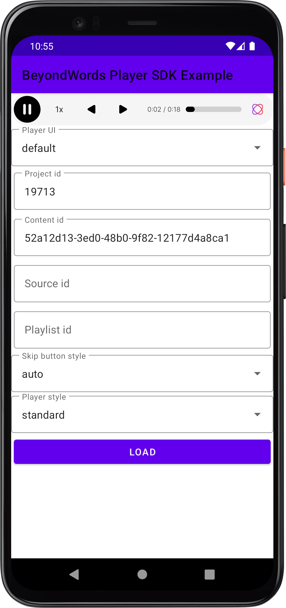

## Getting Started

The first step is to [create an account](https://dash.beyondwords.io/auth/signup)
and generate some content.

### Add the JitPack repository to your root build.gradle at the end of repositories

```gradle
allprojects {
    repositories {
        ...
        maven { url 'https://jitpack.io' }
    }
}
```

### Add the dependency to your app build.gradle

```gradle
dependencies {
    implementation 'com.github.beyondwords-io:player-android:+'
}
```

### Add PlayerView to your view hierarchy by any of the two options:

* Add PlayerView to your layout xml file

```xml
<io.beyondwords.player.PlayerView
    android:id="@+id/player_view"
    android:layout_width="match_parent"
    android:layout_height="wrap_content" />
```

* Add PlayerView programmatically

```Kotlin
val playerView = PlayerView(context)
playerViewParent.addView(playerView)
```

### Load your content into the player

```Kotlin
playerView.load(PlayerSettings(
    projectId = <ID>,
    contentId = <ID>
))
```

You will need to replace the `<ID>` placeholders with the real identifiers for
your project and content.

`playerView.release()` should be called after this PlayerView has been removed from 
the view system. No other methods may be called on this PlayerView after release.

After running the app, the player should load:


## How it works

The PlayerView uses a WebView under the hood to load the [Web Player](https://github.com/BeyondWords-io/player) 
and provides a Kotlin interface which binds to the underlying JavaScript API.

You can check the API compatibility between the Android and the Web player in the [compatibility.md](./compatibility.md)

To understand how the underlying Web Player works, please refer to its [documentation](https://github.com/beyondwords-io/player/blob/main/doc/getting-started.md#how-it-works).

## How to configure it

The preferred way to configure the player is by logging into the BeyondWords
dashboard, going to the Player tab, and changing its settings.

However, you can also override properties at the app level, for example:

```Kotlin
playerView.load(PlayerSettings(
    projectId = <ID>,
    contentId = <ID>,
    playerStyle = "large",
    callToAction = "Listen to this recipe",
    backgroundColor = "yellow",
))
```

These settings will take precedence over those specified in the dashboard and
allow more flexibility.

These settings can also be changed **after** loading the player, for example:

```Kotlin
playerView.setPlayerStyle("large")
playerView.setBackgroundColor("yellow")
playerView.setPlaybackRate(1.5F)
```

You can also refer to [example app](../example) which showcases the core functionality of the player, including how to build a custom UI.



You can download a precompiled version of the example app from the assets of the [latest GitHub Release](https://github.com/beyondwords-io/player-android/releases).
